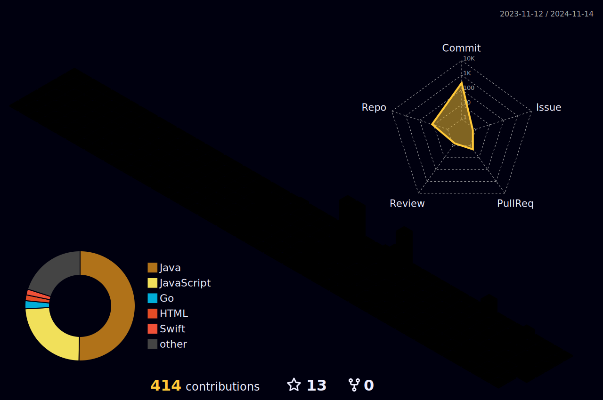

# 💫 About Me:
Code👩🏻‍💻 Money💸 English🌎

<!--  -->

## 🌐 Socials:
  

# 💻 Tech Stack:
                           
# 📊 GitHub Stats:
 
 

## 🏆 GitHub Trophies

<!-- ### ✍️ Random Dev Quote
 -->

### 🔝 Top Contributed Repo

---

<!-- Proudly created with GPRM ( https://gprm.itsvg.in ) -->